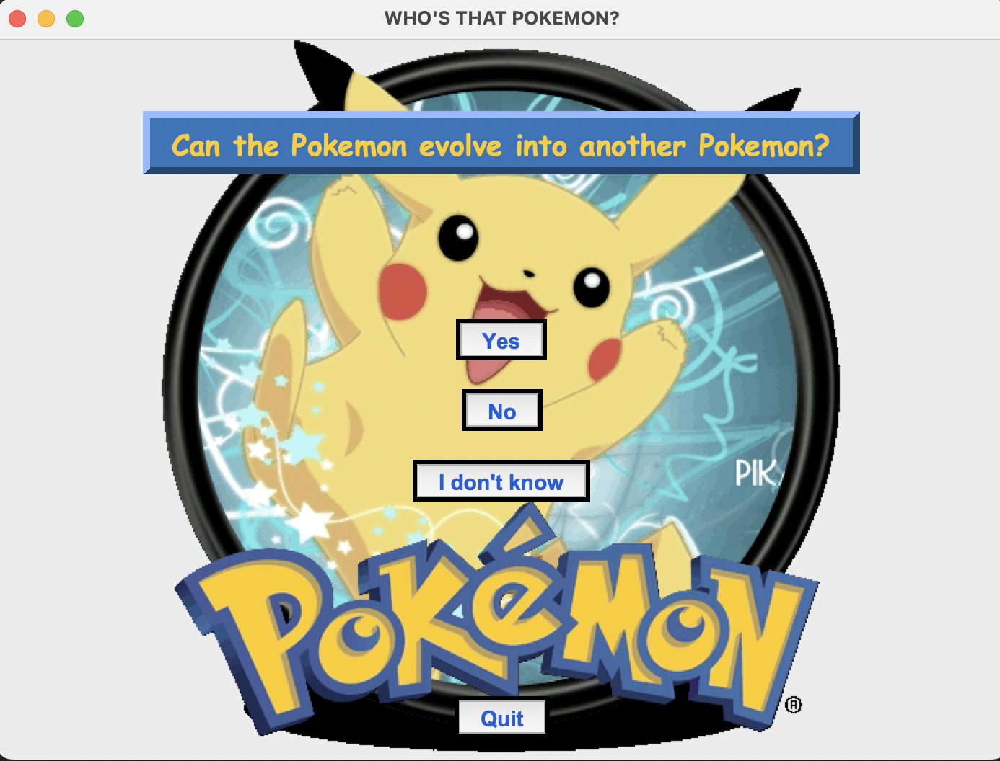

# Who's That Pokémon?

This project is an interactive game that challenges players to think of a specific Pokémon (from Generations 1 and 2) and then uses a knowledge-representation-based approach to guess its identity through a series of yes/no questions. 

This project is inspired by the popular "Who's that Pokémon?" bumper segment that used to air during commercial breaks in the Pokémon anime.

The project utilizes a rule-based system that populates a knowledge base with rules about Pokémon and uses forward-chaining to infer new rules and facts from existing knowledge. The user interacts with the system by answering yes/no questions asked by the system. Based on the answers given, the system updates its knowledge base and reasons further to narrow down the potential Pokémon that the user is thinking of. 

The project is designed to be entertaining and engaging for players of all ages and levels of Pokémon expertise, while also demonstrating the capabilities of knowledge representation and reasoning techniques.

More details about the project can be found in the file named **Project Report.pdf**.

## Execution Instructions

The game runs in pure Python (tested for Python versions 3.7 - 3.10), and requires no additional libraries to be installed.

All that is required is for the root directory of the project to be in the PYTHONPATH environment variable.

This can be achieved in a bash compatible shell by running the following command:

```commandline
export PYTHONPATH="${PYTHONPATH}:<path-to-parent-dir>/whos-that-pokemon"
```

Then the game can be run simply by executing the main.py file as follows:

```commandline
python main.py
```

After the above steps are completed successfully, it should display the following window:



Think of a Pokémon and answer 'Yes' or 'No' to the questions displayed on the screen. If you are uncertain of the answer, click on 'I don't know'. The game will end if one of the following conditions is met:
- the correct Pokémon is guessed.
- there are no Pokémon in the knowledge base that match the answers given.
- there are no more valid questions that can be asked. 

In any case, the final outcome will be shown on the screen.

Have fun playing!